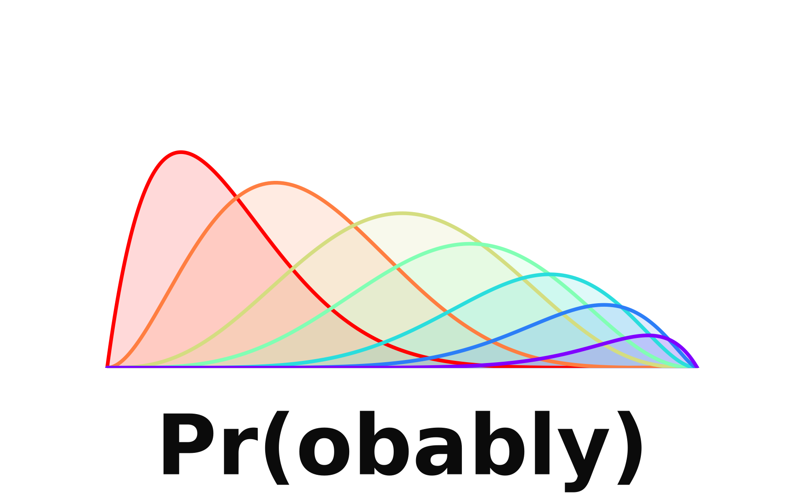
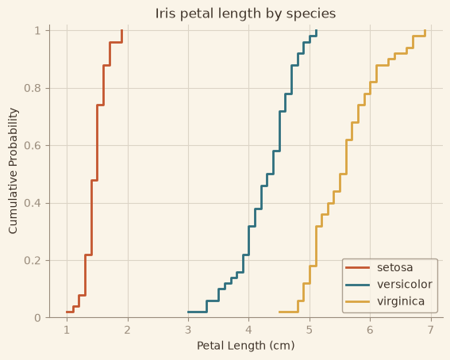

<p align="center">
  <picture>
    <source media="(prefers-color-scheme: dark)" srcset="examples/assets/logo-dark.png">
    
  </picture>
</p>

# probably

[](https://github.com/andrewpatton/probably/actions/workflows/ci.yml)
[](LICENSE)
[](pyproject.toml)

`probably` is a toolkit for working with probability distributions, predictions, and
Monte Carlo simulation. It is a bolt-on to [scikit-learn](https://scikit-learn.org/),
[numpy](https://numpy.org/), and [scipy](https://scipy.org/) — it adds the specialized
pieces they leave out and returns their objects, rather than replacing them.

🚧 Early development. The public API is still taking shape; pin versions and expect
breaking changes before `1.0`.

## Installation

```bash
pip install probably
```

## Usage

### Identify a distribution

`what_is_this` fits every family the data could have come from and returns both the
winning scipy distribution and the evidence behind it.

```python
import numpy as np
from probably.dx import what_is_this

yields = np.random.default_rng(0).lognormal(0, 0.5, size=300)
distribution, diagnostics = what_is_this(yields)

distribution.dist.name      # 'lognorm'
distribution.ppf(0.95)      # 2.269
distribution.rvs(1000)      # a plain scipy frozen distribution

for row in diagnostics:
    print(row["distribution"], row["verdict"])
```

```
lognormal yes
gamma maybe
normal no
```

The ordering is by fit quality, not by p-value. `verdict` is the separate question of
whether that family fits at all — something always ranks first, even when nothing fits.

### Test a hypothesis you already have

```python
from probably.dx import is_this_normal, is_this_lognormal

is_this_normal(yields)[0]["verdict"]      # 'no'
is_this_lognormal(yields)[0]["verdict"]   # 'yes'
```

Every check answers `"yes"`, `"no"`, or `"maybe"`. Also available for `beta`, `gamma`,
`exponential`, and `uniform`.

### Compare samples

```python
from probably.dx import is_this_different

result = is_this_different(control, {"treated": treated})[0]
result["verdict"]        # 'yes'
result["prob_greater"]   # 0.93 — chance a treated value beats a control value
result["overlap"]        # 0.34 — share of density the two have in common
```

Effect sizes lead; p-values are corrected across a batch of comparisons.

### Describe

```python
from probably.dx import describe

describe(yields)             # n, mean, median, std, variance, min, q1, q3, max, range
describe(yields, depth=2)    # the above plus skew, kurtosis, iqr, mad, cv, sem
```

### Prediction intervals

```python
from sklearn.ensemble import RandomForestRegressor
from probably.predict import ProbablyConformalRegressor

model = ProbablyConformalRegressor(RandomForestRegressor(), coverage=0.9)
model.fit(X_train, y_train)
low, high = model.predict_interval(X_test)
```

Split conformal intervals that contain the true value at the requested rate, with no
assumptions about the model or the noise. Passes `check_estimator`.

### Plots

```python
from probably.viz import simple_histogram, simple_ecdf

simple_histogram(yields, xlabel="Yield")
simple_ecdf({"control": control, "treated": treated})
```

<p align="center">
  
</p>

Every `simple_*` chart takes any vector, returns a matplotlib `Axes`, shares one theme,
and accepts `filepath=` to write a PNG or JPEG. Available: `simple_histogram`,
`simple_kde`, `simple_kde_2d`, `simple_ecdf`, `simple_qq_normal`, `simple_pp_normal`,
`simple_scatter`, `simple_bar`, `simple_roc`, `simple_2x2`.

## Examples

[`examples/`](examples/) holds a standalone runnable script for every public function.

## Development

```bash
conda activate probably
pip install -e ".[dev]"

pytest              # tests, including doctests
ruff check .        # lint
black --check .     # format
mypy src            # type check
```

## License

[MIT](LICENSE)
